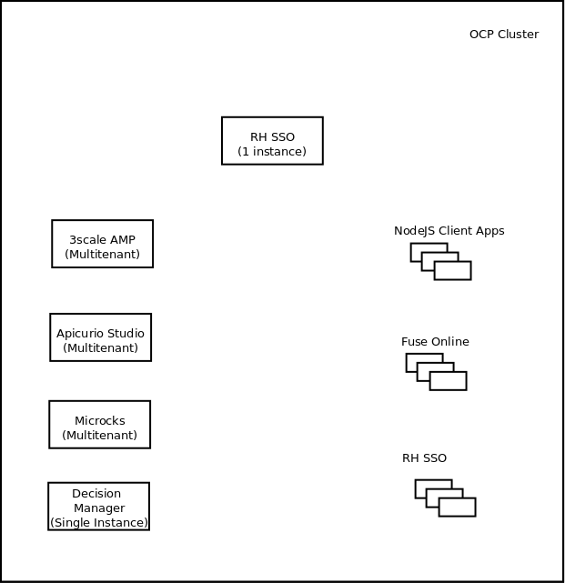

:scrollbar:
:data-uri:
:toc2:

== RHTE Demo Lab - Usecase 1

This lab showcases the API Lifecycle. The usecase is as follows:

. Design a REST API and create sample request and response data.
. Use mockups of the APIs to facilitate integration.
. Provide API Management of the APIs.
. Use a client application to acccess the APIs.
. Use a camel route to orchestrate the APIs.
. Provide single-sign-on for access to the APIs.

=== Products & Technologies

. Apicurio Design Studio
. Microcks Mock Services
. Red Hat 3scale API Management Platform
. Red Hat Fuse Online
. Red Hat Single Sign On Server
. Red Hat Decision Manager
. Red Hat OpenShift Container Platform
. github
. NodeJS

=== Deployment

.Deployment Diagram

==== OCP Cluster:

. Lab specific cluster
. Seeded with user1-99 identities
. Provide RHSSO and use OpenShift Identity Provider
. Ansible playbook and scripts for automated deployment.

==== Red Hat Single Sign On:

. Provide different realms for 3scale, apicurio & microcks
. Provide OAuth clients for 3scale, apicurio & microcks
. Provide OpenShift Identity Provider 
. Template with required Images, realms & oauth clients

==== 3scale AMP:

. Multi-tenant environment
. Each user gets own tenant for setting up APIs & dev Portal
. Integrate Dev Portal for SSO with OpenShift identity
. Template with multi-tenant deployment & creating tenants.

==== Apicurio Studio:

. Multi-tenant environemnt
. Identity provided by Openshift
. Integrate with *github* for exporting APIs.
. Template for deployment.

==== Microcks:

. Multi-tenant environment
. Identity provided by Openshift
. Provide mock URLs to be used in 3scale
. Template for deployment.

==== NodeJS:

. Client Application
. One per user
. Template to be provided for deployment

==== Fuse Online:

. One instance per student
. deployed and ready for use
+
NOTE: Cluster Quota for secrets & service accounts needs to be configured based on number of projects running in the cluster. Rough estimate is 9 x No. of Projects + any custom secrets

==== Decision Manager API Service

. One instance per student
. Provide template for deployment

=== Problem Statement

Two parts:

==== Backend:

2 APIs in Insurance domain:
- One API for Insurance Quote calculation (REST API using Decision Manager)
- One API for License Verification (mock service)

==== Frontend:

Fuse Camel route orchestrating the APIs, getting the request from a AMQ queue, and returning response to a response queue. 
NodeJS application providing simple User interface with an application form for requesting the quote, and showing the response. The NodeJS writes the request to the Camel route  via AMQ queue, and picks up response from response queue.

=== Design

==== API Provider

Use Apicurio, Microcks, 3scale & SSO.

.Lifecycle:

. DrivingLicenseService: https://github.com/satyaj/rhte-usecase1-demo/blob/master/services/DrivingLicenseService_1.0.json
. InsuranceQuoteService: https://github.com/pszuster/rhte-insurance-quoting-rhdm

==== API Consumer

Provide NodeJS client application that sends a message to Camel running on Fuse Online. The message kicks off the camel route, which integrates 2 backend API services running on 3scale and provides the response to the client application.

. NodeJS Application: TBD
. Fuse On OpenShift project:  TBD

=== Progress

. Apicurio
.. Apicurio on OpenShift tested in multi-tenant mode with Identity Provider github,
.. TBD: test Apicurio on OpenShift with OpenShift v3 identity provider.
.. Update Memory limit to 2000 MiB for apicurio-studio-api deployment.

. Microcks
.. Microcks on OpenShift tested in multi-tenant mode with Identity provider OpenShift v3.
.. Microcks deployment readiness probe timeout to be increased (600 s).
.. TBD: Use CREATE methods to seed data on microcks

. 3scale AMP
.. Multi-tenancy verified
.. TBD: SSO with 3scale developer portal

. RH SSO

.. Tested with Apicurio, Microcks & 3scale
.. Tested Using single instance with all products
.. Tested using multiple realms (apicurio, microcks & 3scale)
.. Using OAuthTokens for Openshift Identity Provider and SSO integration.
.. Tested RH SSO integration with Dev Portal running on SaaS.

== References

. https://developers.redhat.com/blog/2018/04/11/api-journey-idea-deployment-agile-part1/
. https://apicurio-studio.readme.io/docs/getting-started
. http://microcks.github.io/
. https://access.redhat.com/documentation/en-us/red_hat_3scale/2.2/html/developer_portal/authentication#enabling_and_disabling_authentication_via_red_hat_single_sign_on

